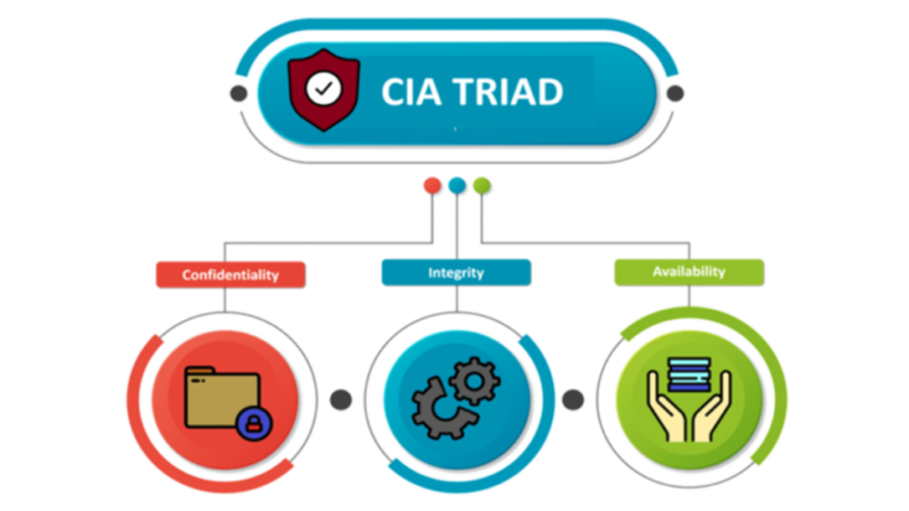

# Introduction to Cyber

Cybersecurity is an ever-growing and ever-evolving field. With today’s constant fast-paced increase in new industrial products and infrastructures comes an equally increasing potential amount of cyberattacks. This lesson introduces the field of cybersecurity and related terminology.

## `What is Information Security?`

### Information Security Vs. Cybersecurity

> Cyber is a broad term often used when discussing both computing and networking.
> The beginning of the internet was not about the security but about the way to connect.

#### Information Security

Information security is a field based on techniques that safeguard data stored in computers or transmitted among them against unauthorized access and misuse.

#### Cybersecurity

Cybersecurity is a field that involves protecting computer systems and networks against cyberthreats using both computer-based and physical means.

- Cybersecurity experts are often divided into two groups:
  - Blue Team, which operates in a defensive role
  - Red Team, which operates in an offensive role

### Impact of Information Security

#### Technological Impact

Nowadays, we heavily rely on technology since it plays an important role in our daily lives. Technology can be found in water purification facilities, airports, autonomous vehicles, drones, and more. Each device or facility that implements technology requires strong security measures to prevent its systems from being hacked.

> Cybersecurity is needed everywhere. Every technological device requires protection.

### Principles of Information Security

#### Confidentiality
Confidentiality, also referred to as privacy, is the first principle of information security. It calls for secure storage and transmission of information. Confidentiality also deals with proper data classification and management.

#### Integrity
Integrity typically deals with verifying the consistency of the data that passes from one computer system to another. Unauthorized third-parties should not be able to modify it.

#### Availability
Data and resources need to be available. Availability is maintained using different methods, such as hardware maintenance, software patching, and network optimization. Backups and dedicated hardware can also ensure that various types of attacks or malfunctions do not affect it.

### Hacking in Information Security
Hacking can be interpreted differently based on the scenario. 
The term generally describes a situation in which the functionality of a software or hardware product is altered and used in a way that contradicts the intended use originally set by the developer or manufacturer. In the realm of cybersecurity, hacking is usually associated with obtaining unauthorized access to a local or remote system.

> Bypassing limitations set on a product or a program is also considered a form of hacking.

## `Hacker & Malware Types`

### What is a Hacker?

#### Hacker
The term **hacker** usually refers to a computer expert who uses skill and knowledge to perform unlawful actions. A hacker tries to **bypass** security mechanisms and **exploit vulnerabilities** using various methods that ensure their anonymity. Hackers employ advanced techniques to extract sensitive data from a targeted computer or website, including user names, passwords, credit card information, and more.

> Although the term ‘hacker’ has negative connotations, different types of hackers exist, and not all hackers have malicious intentions.

### Delegation of Responsibilities

#### Red Team
In an organization, the Red Team includes a group of security experts who actively investigate and probe corporate systems in search of vulnerabilities. The Red Team performs bench tests and live tests on the systems. Red Team professionals are also known as Penetration Testers.

#### Blue Team
The Blue Team unit in an organization consists of information security and cybersecurity experts, whose role is to defend systems by implementing security settings, configurations, measures, and policies.

#### Purple Team
Purple Team is a term used to describe personnel that do not officially belong to red or blue teams, but perform operations that are typically handled by both.

### The Hacker’s Mindset

> A security expert needs to safeguard an entire system, but a hacker only needs to find a single flaw to breach it.

#### There is Always a Way in
When it comes to the cyber world, a hacker’s mindset is based on the offensive approach to computing. A hacker begins planning an attack knowing there is always a way to penetrate a targeted system. Hackers are typically competitive, challenge-seeking individuals who continuously strive to advance their cyber knowledge and development skills.

#### Character Traits
- Anything is possible
- Be competitive
- Think creatively
- Bug bounties
- Accept challenges
- Love what you do!

### Hacker Types

#### White Hat
White Hat hackers are ethical hackers who specialize in compromising computer operating systems, and use their abilities for good intentions, such as identifying vulnerabilities in systems or networks before they can be compromised by malicious hackers.

#### Black Hat
Black Hat hackers are malicious hackers who usually infiltrate computer systems for personal gain, such as money, power, political influence, revenge, or to cause damage. Black Hat hackers work on their own or in groups, and mostly engage in criminal and illegal activities.

#### Gray Hat
Gray Hat hackers are situated somewhere between white hats and black hats. They are generally not motivated by personal gain or a desire to cause damage, but may technically commit illegal actions. It is not a good idea to hack into unauthorized systems even with good intentions, since there may be legal consequences.

### Hacker Motivations

#### Financial Gain
Most hackers are motivated by financial gain. As a result, financial organizations become major targets for such cyberattacks. Nonetheless, hackers can also target smaller businesses, whose systems are not secure enough and can easily be hacked. Home users also fall victim to financial gain attacks due to weak security systems, social engineering, or malware.

#### Espionage
Hackers who belong to government agencies usually try to steal information from foreign countries or corporations that retain valuable data. In some cases, hackers working for commercial companies perform attacks as part of industrial espionage. The targeted information can be political or related to manufacturing operations.

#### FIG
Fun, Ideology, and Grudge (FIG) is a general term used to describe motivations that are based on personal feelings and ideologies the attacker has towards a certain country, company, organization, or group of people. FIG also includes “Hacktivism,” which can be politically oriented, or based on anarchic civil disobedience.

### Active Domains

#### Applicative
Applicative attacks focus on websites or applications, and will typically be launched from remote locations, perhaps even from a different continent. Since most applications today interact with infrastructure, they will be obvious targets.

#### Infrastructure
Infrastructure attacks focus on organization networks, and may be follow-ups to canal applicative attacks or social engineering. Infrastructure in a company is meant to ensure that the network is secure from external or internal attackers.

#### Hardware
Hardware attacks are the most complex types of attacks, and require advanced knowledge in fields such as reverse engineering and electronics. Unlike in other domains, in hardware exploitation, the target is the product itself, rather than the company.

## `Cybersecurity Terminology`

### Cybersecurity Terms

#### Cybersecurity
Cybersecurity refers to the process of securing networks against various attacks. It is managed by IT teams or experienced security professionals.
Safeguarding computer systems has become increasingly difficult over the years since the number and variety of new cyberattacks is constantly on the rise.

#### Cyberattack
A cyberattack is any hacking attempt to steal information, corrupt systems, or manipulate them in networks, companies, and even personal computers.

#### Cybercrime
Cybercrime refers to illegal actions that breach targeted cybersystems for various purposes.

#### Botnet
A Bot is a device that can be used to perform automated, and often malicious tasks. 
A Botnet refers to a group of infected computers (bots) managed by a hacker.

#### Vulnerability
Vulnerability is a weakness, flaw or breach in the security of the computer system. Vulnerabilities are found everywhere, affecting computers and users alike. They exist in operating systems, services, and software and hardware components.

#### Exploit
The term exploit refers to using software applications or code to take advantage of a system vulnerability.
By doing so, an attacker can obtain additional capabilities within the targeted system.
There are many ways to perform exploits, and each method is tailored to the weaknesses of the targeted system.

#### Malware
Malware (malicious software) is a program that serves several functions, and usually carries a payload that can exploit a vulnerability within the system to perform different actions according to the attacker’s agenda.

### Malware Types

#### Virus
A computer virus is a type of malicious software that affects computers.
Once the computer is infected, the virus replicates itself, spreading to other programs, and infecting files on the computer through malicious code injection.

#### Worm
A computer worm is a type of malware that overloads the computer system by continuously replicating itself.
Once the worm is activated, it does not need to attach itself to any software or depend on human interaction to spread itself to other computers.

#### Trojan
A Trojan is a software that usually spreads through malicious email attachments, or when users visit infected websites. The victim needs to execute the infected program that is disguised asa legitimate one to activate the Trojan.

#### Ransomware
Ransomware is a type of malicious program that encrypts the victim’s data and holds it hostage while waiting for a cryptocurrency payment.
The encrypted data is typically restored only when the victim pays the attacker a specified sum of money.

#### Scareware
Scareware is a form of malware that uses social engineering to trick a user into believing their computer is infected with a virus, and make them use a fake program to remove it.
Unfortunately, the software itself Operates as a virus.

### Offensive Security Terms

#### Keylogger
A keylogger is a type of malware cybercriminals use to log their victim's keystrokes on a targeted device and record sensitive information, such as usernames and passwords. The keylogger is usually programmed to send this data to the attacker.

#### Social Engineering
Social engineering occurs when a hacker manipulates a person into revealing sensitive and personal information. For example, con artists can interact with their intended victims and try to obtain their passwords.

#### Encryption
Encryption is the process in which information is encoded to prevent unauthorized people from accessing or reading it.

### Defensive Security Terms

#### Firewall
A firewall is a security system that monitors incoming and outgoing network traffic and filters it according to predefined rules. The firewall has an integral part in securing computer systems.

#### Network Access Control
Network Access Control (NAC) is a network management software solution that monitors network access and implements security policies to mitigate risks. NAC helps identify, resolve, and prevent network security threats.

#### Endpoint Security
Endpoint Security solutions typically refers to tools and techniques used to protect
endpoint components from cyberattacks, such as zero-day exploits.

> Precautionary steps should be taken to prevent cyberattacks.

#### IDS
An Intrusion Detection System (IDS) is designed to monitor and detect suspicious network traffic based on signatures. IDS systems work best in combination with IPS systems. For example, suppose an attacker sends a malicious file over a network. In that case, the system will alert the user that their login details were compromised.

#### IPS
An Intrusion Prevention System (IPS) is an advanced software application that identifies and blocks suspicious traffic. Suppose a user sends a malicious file over a network. In that case, the system will prevent them from connecting for a given amount of time.

### Breaches Worldwide

#### eBay
In 2014, eBay discovered that hackers had access to its system for 229 days. During that time, sensitive information about 145 million users was exposed, including email addresses, residential addresses, birth dates, first names, and encrypted passwords. Hackers were able to penetrate the system using the certificates of three corporate employees.

#### Stuxnet
Stuxnet is one of the largest cyberattacks in the world. It is a malicious worm that spreads by plugging a USB flash drive into a computer that is connected to the network. Once inside the system, the worm begins to spread to other computers on the network.

#### WannaCry
According to reports, the worm caused damage to Iranian nuclear facilities in 2010. The WannaCry cyberattack first came to light in 2017. This ransomware cryptoworm targeted Windows computers around the world. Once activated, the ransomware encrypted the computer's data, and users could not access their files. If the victims wanted to decrypt the files, they had to pay $300 in Bitcoin currency, hoping that the hackers would release the data.

## `Modern Cyberattacks`
### Modern Cyberattacks
<a href="https://threatmap.checkpoint.com" target=_blank>Live Cyber Threat Map | Check Point</a>
  <a href="https://cybermap.kaspersky.com" target=_blank>MAP | Kaspersky Cyberthreat real-time map</a>

- Despite major advancements Bog Scorch Fryecom in the field of cybersecurity, cyberattack statistics are on the rise.
- Some studies suggest that one THREAT MAP out of thirteen links on the web leads to a malicious site.

### Recent Cyberattacks
#### WannaCry

- New vulnerabilities are constantly identified both in new and old products.
- A certain amount of time passes between the moment of the vulnerability’s discovery and its subsequent patching.
- Even when a patch becomes available, users might take a while to apply it.
- As a result, attacks like **WannaCry** were able to infect one out of three computers, even when the vulnerability was patched months earlier.

#### Coronovirus Map
- Many Coronavirus map dashboards help track the number of confirmed cases.
- Hackers exploit the global emergency to create their own fake dashboards.
- These dashboards enable hackers to scrape user data, including user names, passwords, credit cards, etc.

### Mirai Botnet
Mirai Botnet is malware that targets loT devices connected to home networks. It scans the targeted network in search of devices that can be breached. Once a vulnerable loT device is detected, the botnet scans it and tries to find an active Telnet service that can be used to perform a brute-force attack with default credentials on the targeted system. If an active service is found, the IP and login credentials are used to log in to a server that the attacker can access and use to launch the attack.

> The attack mostly targets IP cameras with default settings.

# :star2: Adresowanie IPv4

- :cinema: [PL] [Adresowanie IP v4. Budowa adresów, obliczenia, podział na podsieci](https://www.youtube.com/watch?v=t3IceGlTjig)
  - adres sieci (ang. network address)
  - adres rozgłoszeniowy (ang. broadcast address)
  - liczbę hostów (+adres pierwszego i ostatniego)

  - adres IP: 192.168.1.145
  - maska podsieci: 255.255.255.128 lub /25

# Introduction to Hardware
Computer Hardware is an ever-growing and ever-evolving field. None the less the fundamental concepts of this field remain relatively the same through the evolution of computer hardware.
In this lesson, the field will be covered, as it an essential part of understanding how a computer works and the operating systems that use it.

## `Hardware`
### Computer Hardware
- Every computer contains hardware components with designated responsibilities.
- All computers must have the core components, such as memory and processor.
- Other components are optional, depending on the intended functionality of the computer.

### Motherboard
The Computer’s motherboard is the most essential internal component of any computer.
It is a Printed Circuit Board (PCB) to which all other components are connected.
It distributes power throughout the PC and enables communication and synchronization among internal components.

> On smaller computers, such as mobile devices, some other hardware can be soldered directly onto the motherboard.

### CPU - Central Processing Unit
The CPU is the brains of the entire system and consists of billions of micro-transistors that manipulate electric currents in order to preform calculations and transfer data.
The CPU is responsible for all calculations performed by the computer, and the execution of software commands. When other dedicated microprocessors are present, such as a GPU, the CPU may redirect some tasks to them.

> The CPU is a complex component that includes other internal components, such as Control Unit, Memory Cache, and Arithmetical Calculation Unit.

### RAM - Random Access Memory
RAM is used to store data for processes and services that are currently in use. It is volatile, which means it is erased upon computer shutdown.
No computer can operate without RAM, since even the OS is loaded into it upon system booting.

> The more RAM the computer has, the better it will be able to handle large amounts of processes.

### Storage - HDD & SSD
Besides the RAM, a computer needs to have long-term, non-volatile storage.
This type of storage is used to store documents and files that need to remain persistent between boots.
The main types of storage nowadays are HDDs and SSDs.
Hard Disk Drives are larger in capacity, but slower than Solid State Drives, which are nowadays becoming the standard in modern devices.

> Modern PCs, laptops, and servers usually come with an SSD for the OS installation, and an HDD as a secondary storage for files and documents.

### GPU - Graphical Processing Unit
The GPU is a somewhat stronger version of the CPU. It is optimized for graphical calculations and the rendering of images and colors.
However, the CPU is a more general-purpose unit, and is faster when it comes to calculations and multitasking processes.

> The GPU is sometimes soldered to the motherboard, but can also be a separate extension that can be added to it.

### NIC - Network Interface Controller
The NIC is a dedicated piece of hardware for receiving and sending network traffic.
A standard NIC will typically be built in to the motherboard, although a faster and more capable card can be installed as an extension.
Special NICs, known as external network cards, can also be connected via standard USB ports.

> The main two types of network interface controllers are the Ethernet Adapter (cable connection) and Wireless Adapter (Wi-Fi).

### I/O

> Besides standard I/O, sensors and transmitters are also considered I/O components.

#### Input Devices
The standard and most common input devices are a keyboard and a mouse. In older systems, input pesese se devices, including keyboards, required drivers. In modern systems, most drivers are standardized seesee 88 andare implemented as Plug & Play modules.

#### Output Devices
Output devices provide content to the user, such as screens or speakers. Devices without a screen for output are known as Headless devices. In modern mobile devices, the screen acts as both an input and output device.

- [bequiet | Power Supply Calculator](https://www.bequiet.com/en/psucalculator)

## `Operating Systems`
### OS - Operating System
The OS is a large, complex piece of software that consists of smaller programs, such as the Desktop Manager, File Manager, and the Kernel.
The OS is responsible for managing resources, user interaction, and much more.
The most common operating systems on the market are Windows, Linux, and MacOS.

> The operating system of a computer is responsible for the execution and management of user permissions, and running other software.

### Common Operating Systems

#### Windows
Windows is the most well-known OS, due to its simplicity and user friendliness. It is commonly used on PCs, but is also available for servers.

#### Linux
Linux is a kernel that runs numerous distributions. They all share the same core, but work with different packages and programs. Unlike Windows, Linux is open-source. 

#### MacOS
MacOS is a proprietary OS owned by Apple. In some aspects, it is similar to Linux distributions, but is more limited in its capabilities.

### Desktop Vs. Server
<table>
<tr>
<th>Desktop</th>
<th>Server</th>
</tr>
<tr>
<td>Desktop oriented OS has more graphical components and a simplified user environment</td>
<td>Server oriented OS is less graphical and more command line based</td>
</tr>
<tr>
<td>Comes prebuilt with many user programs, such as media players and photo viewers</td>
<td>Comes with more server-related programs, such as file sharing software and service managers</td>
</tr>
<tr>
<td>Supports a large variety of I/O devices</td>
<td>Supports a small variety of I/O devices that are the most likely to be present on an actual server</td>
</tr>
<tr>
<td>Supports the standard amount of memory and storage</td>
<td>Supports large amounts of storage and RAM</td>
</tr>
<tr>
<td>Most user-interaction is done directly on the computer</td>
<td>Most interaction is via remote terminal</td>
</tr>
<tr>
<td>Receives constant updates, which means it may sometimes be less stable</td>
<td>Durability is important, so updates are less frequent, and are tested more carefully</td>
</tr>
</table>